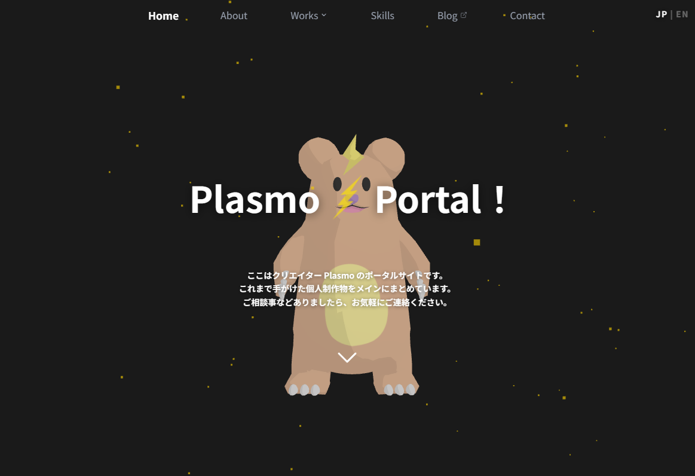

# Plasmo Portal

Plasmoのポータルサイトのコードになります。</br>
Astroで構築しており、静的サイトとして動作します。</br>
公開URL: <a href="https://plasmoportal.com" target="_blank">Plasmo Portal</a>



## 前提条件

以下のライブラリがローカルにインストールされている必要があります。

- Node.js >= 22.12.0

## セットアップ

```sh
# リポジトリのクローン
git clone <your-repo-name>

# リポジトリ直下に移動
cd <your-repo-name>

# 依存関係ライブラリのインストール
npm install
```

## 使用方法

```sh
# 開発サーバーを起動する（localhost:4321）
npm run dev

# 本番用にビルドする（./dist/）
npm run build

# 本番ビルドをローカルで確認する
npm run preview
```

## ページルーティング

任意のルートに `/en` プレフィックスを付けると英語版に切り替わります（例：`/en/works`）。

| ルート   | ページ   |
| -------- | -------- |
| `/`      | ホーム   |
| `/works` | 作品一覧 |

## 主な使用ライブラリ

| 該当箇所         | ライブラリ   |
| ---------------- | ------------ |
| フレームワーク   | Astro        |
| スタイリング     | Tailwind CSS |
| 3Dグラフィックス | Three.js     |

### 依存ライブラリ

**Runtime**

| ライブラリ                  | 用途                            |
| --------------------------- | ------------------------------- |
| `astro`                     | 静的サイトフレームワーク        |
| `astro-icon`                | アイコンコンポーネント          |
| `tailwindcss`               | ユーティリティファーストCSS     |
| `three`                     | 3Dグラフィックス                |
| `@iconify-json/fa-brands`   | Font Awesome ブランドアイコン   |
| `@iconify-json/fa7-brands`  | Font Awesome 7 ブランドアイコン |
| `@iconify-json/mdi`         | Material Design Icons           |
| `@iconify-json/skill-icons` | スキル・技術スタックアイコン    |

**Dev**

| ライブラリ                    | 用途                              |
| ----------------------------- | --------------------------------- |
| `prettier`                    | コードフォーマッター              |
| `prettier-plugin-astro`       | Astroファイル用Prettierプラグイン |
| `prettier-plugin-tailwindcss` | Tailwindクラスの自動整列          |
| `@types/three`                | Three.jsのTypeScript型定義        |

## フォルダ構成

各データは`src/data`内にJSONファイルとして管理しています。

```
astro-plasmo-portal/
├── public/              # 静的アセット
└── src/
    ├── components/
    │   ├── common/      # 共通UIコンポーネント
    │   ├── pages/       # ページレベルコンポーネント
    │   └── sections/    # セクションコンポーネント（home, works, career 等）
    ├── data/
    │   ├── ja/          # 日本語コンテンツデータ（JSON）
    │   └── en/          # 英語コンテンツデータ（JSON）
    ├── layouts/         # ベースHTMLレイアウト
    ├── lib/             # ユーティリティ関数（データローダー等）
    ├── pages/           # Astroファイルベースルーティング
    │   └── en/          # 英語ルート
    ├── styles/          # グローバルCSS
    └── types/           # TypeScript型定義
        ├── data/        # JSONデータの型
        └── ui/          # UIコンポーネントの型
```

## ライセンス

- **コード**（`.astro`, `.ts`, `.js`, 設定ファイル等）
  - [MIT License](./LICENSE)
- **コンテンツ**（`src/data/`, `public/`）
  - [CC BY-NC-ND 4.0](https://creativecommons.org/licenses/by-nc-nd/4.0/)
